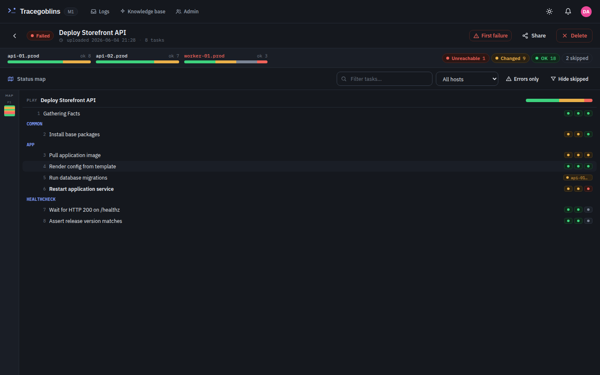
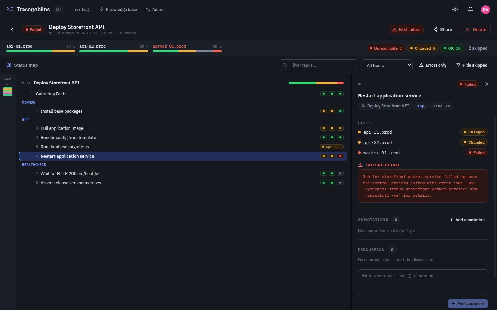
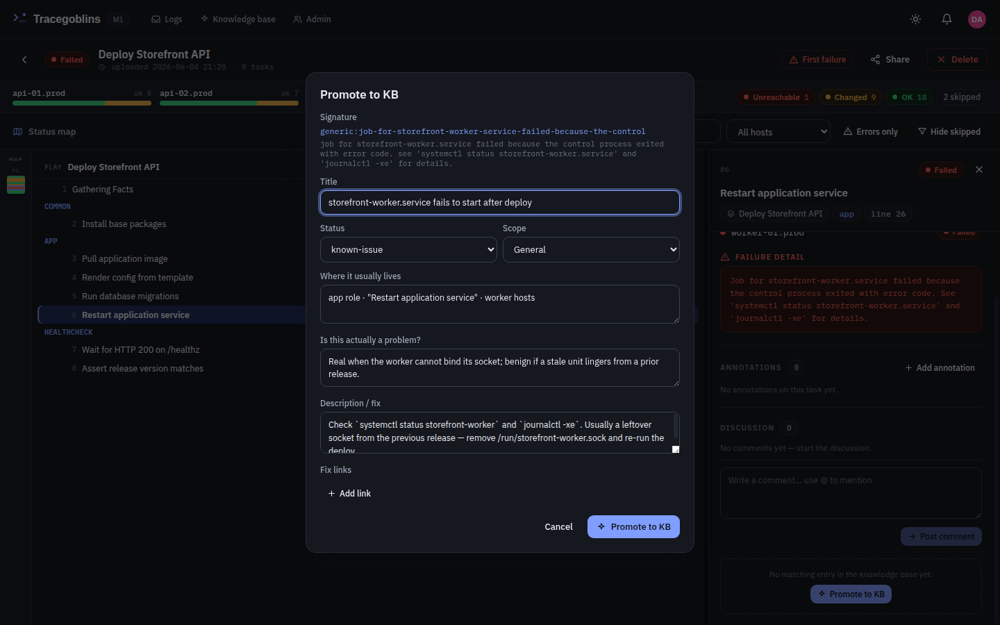
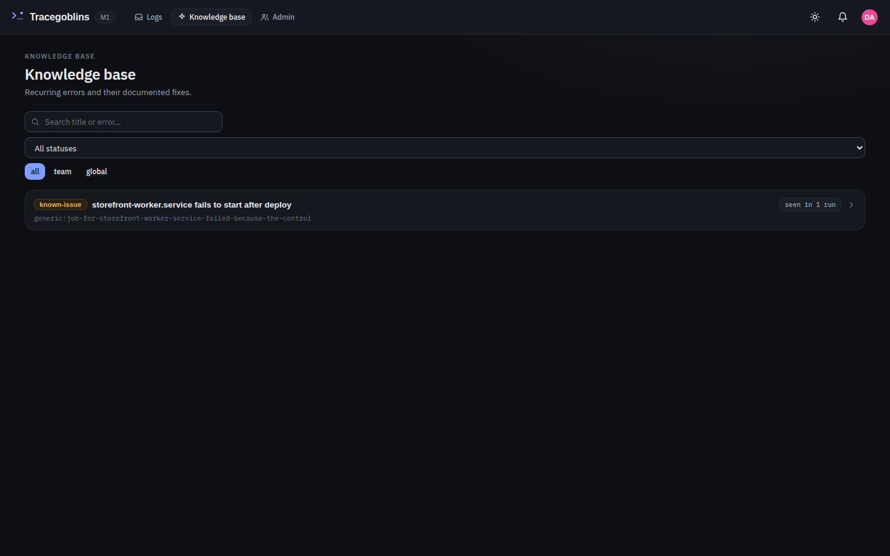
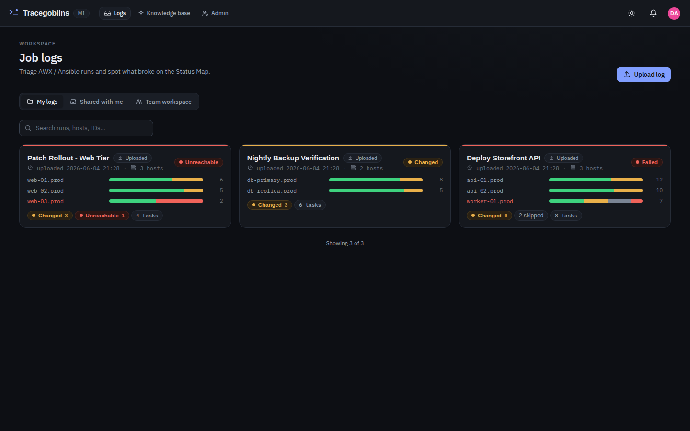
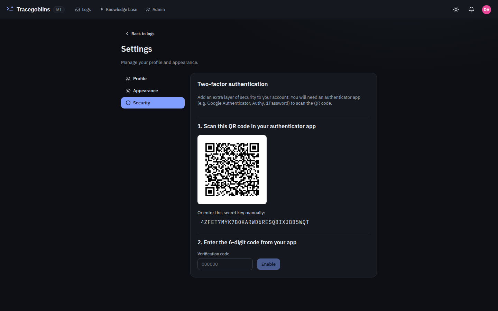
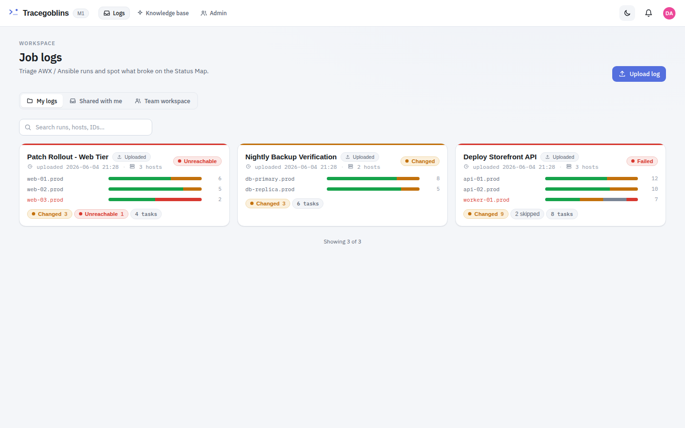

<div align="center">

# 🛰️ Tracegoblins

### Stop scrolling through thousands of lines of Ansible output. *See* what broke.

[](https://github.com/VladoPortos/tracegoblins/actions/workflows/codeql.yml)
[](https://github.com/VladoPortos/tracegoblins/actions/workflows/trivy.yml)
[](https://github.com/VladoPortos/tracegoblins/actions/workflows/scorecard.yml)
[](https://securityscorecards.dev/viewer/?uri=github.com/VladoPortos/tracegoblins)
[](https://github.com/VladoPortos/tracegoblins/pkgs/container/tracegoblins)


**A self-hosted AWX / Ansible log analyzer + lightweight team collaboration platform.**
Pull run logs from your AWX controllers (or paste them), spot failures at a glance on a
color-graded **Status Map**, annotate and discuss them, and grow a **knowledge base** that
auto-matches recurring errors to documented fixes.

Runs as **two containers** — the app + a Postgres companion — behind your reverse proxy.



</div>

---

## Why Tracegoblins?

AWX's raw stdout is a wall of text. When a 600-line playbook fails on host 7 of 12, you scroll.
Tracegoblins turns that wall into a **triageable map**: every task, every host, color-graded by
status, with failures pulsing red — so you find the break in seconds, not minutes. Then it lets
your **whole team** annotate, discuss, and remember the fix.

## ✨ Features

### 🗺️ The Status Map — your single hero view
Every play and task laid out with per-host status dots (ok · changed · skipped · failed ·
unreachable). Jump straight to the **first failure**, filter to **errors only**, search tasks,
or scope to one host. Real per-task durations when synced via the AWX `job_events` API.

### 🧭 Run Path Explorer — walk the actual execution path
Open any run as an interactive left-to-right flow of what *really* happened — reconstructed
from the AWX `job_events` tree. Drill into roles, includes and loops, follow per-host **fork
branches**, and toggle **never-run** greying to see the branches a run skipped. The host-scope
picker doubles as a **triage roster** — every host carries its real worst-status dot, so you
jump straight to the one that failed.

- **Code overlay** — the playbook source at the run's exact revision, with the **resolved
  values** the run actually rendered (`set_fact` / `debug` / module args) and executed vs.
  skipped vs. never-run lines colour-graded inline. Git-link a project once and the overlay
  shows your real code.
- **Module docs at a click** — each task deep-links to its official Ansible module reference,
  and the card face shows the module family (`apt` · `service` · `set_fact`) at a glance.
- **Fired-handler badge** — handlers that were notified *and* flushed are marked, so a
  "ran because something changed" task never reads as plain inline ordering.
- **Copy run summary** — one click yields a Markdown summary (status, per-host recap, and the
  path-to-failure with error excerpts) ready to paste into a ticket or a knowledge-base entry.

### 🔎 Failure analysis + collaboration
Click any task for the full failure detail, affected hosts, and the raw output in a pop-out
viewer. **Annotate** (note · tags · external links) and **discuss** in threaded comments with
`@mentions` — right next to the failure.



### 📚 Knowledge base that learns your errors
Promote any failure into a generalized KB entry. Tracegoblins extracts a **normalized
signature** (host-stripped, secret-collapsed) and `pg_trgm` fuzzy-matches future errors to it —
so the next time that error appears, the documented fix is already attached.

<div align="center">


</div>

### 🗂️ Organized per AWX instance & team
Keep **My logs**, **Shared with me**, and a **Team workspace** cleanly separated. In the team
view, switch between AWX sources with one click, sync on demand, and see synced-vs-uploaded at a
glance.



### 🔐 Security-first, internet-ready
Admin-invite-only onboarding, argon2id passwords, revocable server-side sessions, CSRF, a strict
Content-Security-Policy, encrypted AWX tokens, a full audit log — and **two-factor
authentication (TOTP)**: opt-in for users, enforceable for admins, with one-time recovery codes.



### 🌗 Light & dark, self-hosted fonts
A polished IBM Plex design system with a semantic status palette, in light and dark.



---

## 🚀 Quick start (Docker)

```bash
git clone https://github.com/VladoPortos/tracegoblins.git
cd tracegoblins

# 1) generate strong secrets into .env (needs only python3)
./bootstrap.sh

# 2a) run the prebuilt image …
docker compose pull && docker compose up -d
# 2b) … or build from source
# docker compose up --build -d

# 3) wait for health, then open the one-time setup wizard
curl --retry 20 --retry-all-errors -fsS http://localhost:8000/api/health
# open http://localhost:8000/setup   → create the first admin
```

The published image lives at **`ghcr.io/vladoportos/tracegoblins`** (`:latest` or a pinned
`:vX.Y.Z` via `TG_TAG`). While the repo is private the image requires `docker login ghcr.io`
first; building from source needs nothing but Docker.

Behind a reverse proxy, keep `COOKIE_SECURE=true` and set `FORWARDED_ALLOW_IPS` to your proxy's
network. The proxy terminates TLS and owns HSTS.

### Configuration

Configuration is environment-only — [`.env.example`](.env.example) documents every option with
its default. Two settings deserve a conscious decision before going live:

- **`MFA_ADMIN_REQUIRED`** (default `true`) — admins are redirected to 2FA enrollment and
  cannot use the app until they enrol. Set to `false` to make 2FA opt-in for admins too.
- **`RETENTION_DAYS`** (default `90`) — see below.

### Retention

A background sweep **permanently deletes AWX-synced runs** (`source='awx'`) older than
`RETENTION_DAYS` — including their tasks, raw log, annotations, comments, and shares. A run's
age is its actual job run time (falling back to import time when AWX didn't report one).
Manually uploaded or pasted runs are **never** touched. Default is **90 days**; set
`RETENTION_DAYS=0` to disable the sweep entirely.

### Local development (hot reload)

```bash
docker compose up -d db
cd backend && uv run uvicorn app.main:app --reload --port 8000   # API  (terminal 1)
cd frontend && npm run dev                                       # SPA  (terminal 2)
```

---

## 🧰 Tech stack

| Layer | Tech |
|------|------|
| **Backend** | Python · FastAPI · SQLAlchemy 2.0 (async) · Alembic · Pydantic v2 · APScheduler |
| **Database** | PostgreSQL 16 — JSONB + `pg_trgm` / full-text |
| **Frontend** | Vite · React 19 · TypeScript · TanStack Query · self-hosted IBM Plex |
| **Packaging** | One multi-stage Docker image (Node builds the SPA → Python serves API + static) |
| **Auth** | argon2id · revocable sessions · CSRF · TOTP 2FA |

No Redis, no Celery — background work (AWX sync, retention) runs on APScheduler with a Postgres
advisory-lock leader. Two containers, that's it.

## 🔒 Security at a glance

- argon2id password hashing; httpOnly/Secure, server-side **revocable** sessions
- CSRF double-submit, login rate-limiting, strict CSP + security headers
- AWX tokens **encrypted at rest**; TOTP secret encrypted; one-time hashed recovery codes
- full **audit log**; admin-invite-only (no public signup); AWX base URLs validated to http(s)
  and pagination is pinned to the controller's origin so the token can't be sent off-host
  (AWX itself usually lives on a trusted private network — that is intended, not blocked)
- supply-chain CI: **CodeQL** + Trivy + OpenSSF Scorecard + Dependabot, SHA-pinned actions

Designed to sit on the internet behind a TLS-terminating reverse proxy. Configuration is
environment-only.

---

<div align="center">
<sub>Self-hosted. Two containers. Your logs stay yours.</sub>
</div>
